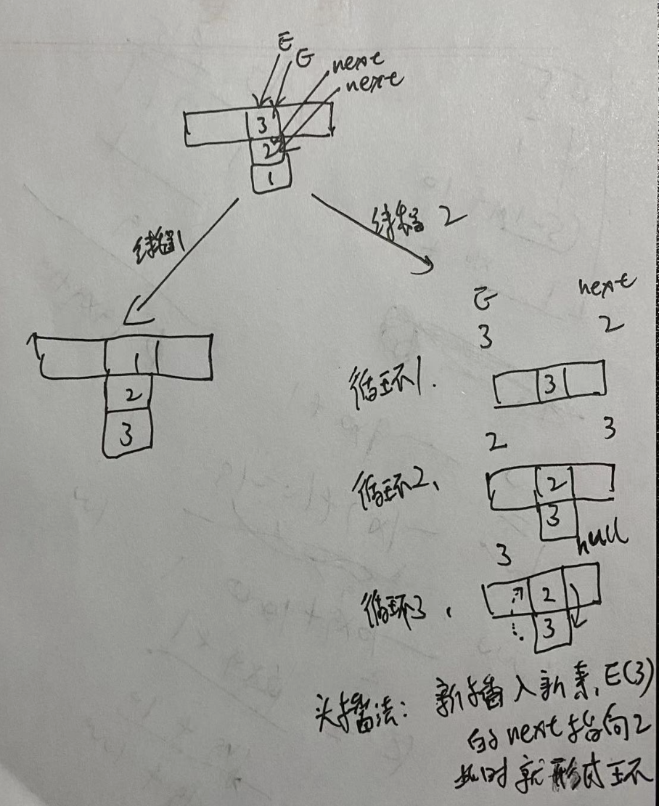

#### volatile和synchronized的区别
* volatile仅能使用在变量级别,synchronized则可以使用在变量,方法
* volatile本质是在告诉jvm当前变量在寄存器中的值是不确定的,需要从主存中读取,synchronized则是锁定当前变量,只有当前线程可以访问该变量,其他线程被阻塞住
* 多线程访问volatile变量不会发生阻塞，而synchronized可能会阻塞。
* volatile能保证数据的可见性，但是不能保证原子性；而synchronized可以保证原子性，也可以保证可见性。
* 关键字volatile解决的是变量在多个线程之间的可见性；synchronized关键字解决多个线程之间访问公共资源的同步性。

#### synchronized和lock区别
* Lock是一个接口，而synchronized是Java中的关键字，synchronized是内置的语言实现；
* synchronized在发生异常时，会自动释放线程占有的锁，因此不会导致死锁现象发生；而Lock在发生异常时，如果没有主动通过unLock()去释放锁，则很可能造成死锁现象，因此使用Lock时需要在finally块中释放锁；
* Lock可以让等待锁的线程响应中断，而synchronized却不行，使用synchronized时，等待的线程会一直等待下去，不能够响应中断；

#### 大顶堆小顶堆怎么删除根节点
* 堆是一颗完全二叉树，任一非叶子节点的关键字不大于(不小于)左右孩子节点的关键字,堆的实现数据结构是数组,根据其具有下标这一性质来执行左右节点,它不具有查找功能
* 对于一个小顶堆的各种操作如下:
    * 构建:从末尾的非叶子节点开始往前调整,越小的数据往上移动,被调整之后的节点如果还有子节点,需要递归进行调整
    * 插入:新增元素首先在堆的末尾插入,然后根据小顶堆的性质,自底向上,递归调整
    * 删除:删除操作只能在堆顶进行,删除了之后,会将末尾叶子节点的元素,调整到堆顶,然后自顶向下重复构建堆的过程
    * 堆排序:第一次建完小顶堆之后,最小的元素位于0号下标,将0号元素与最后一个元素交换,然后再将剩下的树再建小顶堆,循环操作只到完成所有数据,这样得到的排序结果是降序的

#### CSRF攻击是什么，怎么预防 https://blog.csdn.net/weixin_51211461/article/details/123958272
* CSRF 代表跨站请求伪造。这是一种攻击
* 验证HTTP Referer字段,该字段记录了该HTTP请求的来源地址,由于CSRF攻击来源都是第三方站点,因此服务器可以禁止来自第三方站点的请求
* 在请求地址中添加token并且验证,由于第三方站点不能获取token值,所以可以防止
* Cookie的SameSite属性可以禁止第三方Cookie,如果是第三方站点发起的请求,就要让浏览器禁止发送某些关键Cookie数据到服务器

#### 快速排序的思想?
* 先从数列中选取一个数作为基准数
* 分区过程中,将比这个数大的数放在它的右边,小于或等于它的数全放在它的左边
* 重复上一个步骤,知道左右区间只剩下一个数

#### 1.7HashMap扩容形成的环（头插法）
* 为什么HashMap线程不安全?
  
* 1.7环形成

   前提：1.7在2个线程同时扩容resize时候，发生在扩容中的transfer方法
	
	https://www.bilibili.com/video/BV1n541177Ea?spm_id_from=333.337.search-card.all.click&vd_source=a30bba17223939a1bea53d90c11ab6f3
	
	https://www.bilibili.com/video/BV1yY4y1G7WJ?spm_id_from=333.337.search-card.all.click&vd_source=a30bba17223939a1bea53d90c11ab6f3
	    
	头插入法
	
	此时插入就完成。但是已经把元素1弄丢了。
	如果get元素1时候；就会在环上形成无线查询下去。
	
	jdk1.8使用了尾插法，1.8树化时仍存在死循环问题，尾插法不过是减少了出现概率而已
* 扩容后位置变化：扩容都是变为原长度2陪
	* 原hash位置或者原hash+扩容长度（这样就能够把HashMap中的链表长度变短了）
	* 比如 5，13 在长度为8时候取模都存在index=5位置。扩容为13后某一个index=5，一个index=13
	
#### ConcurrentHashMap
* ConcurrentHashMap 1.7  Segment[实现ReentrantLock接口] + HashEntry（类似hashtable） 锁粒度为Segment
* ConcurrentHashMap 1.8 HashEntry + synchronized + CAS + 红黑树  锁粒度为HashEntry
				